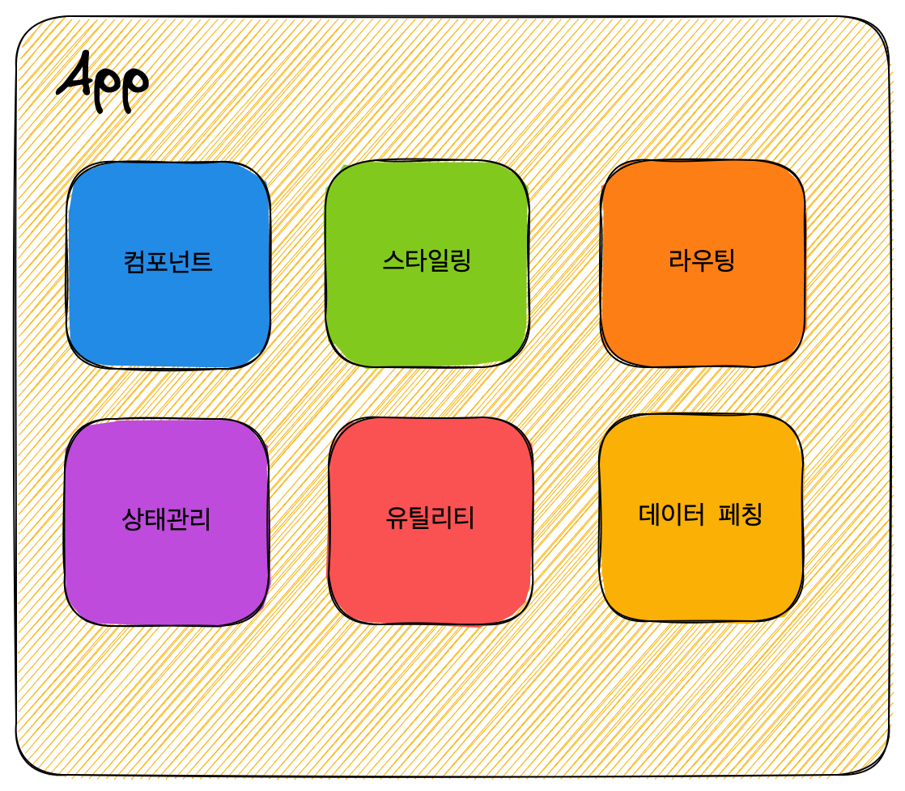
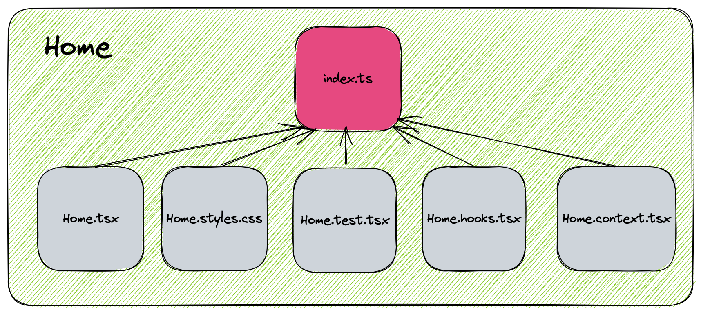
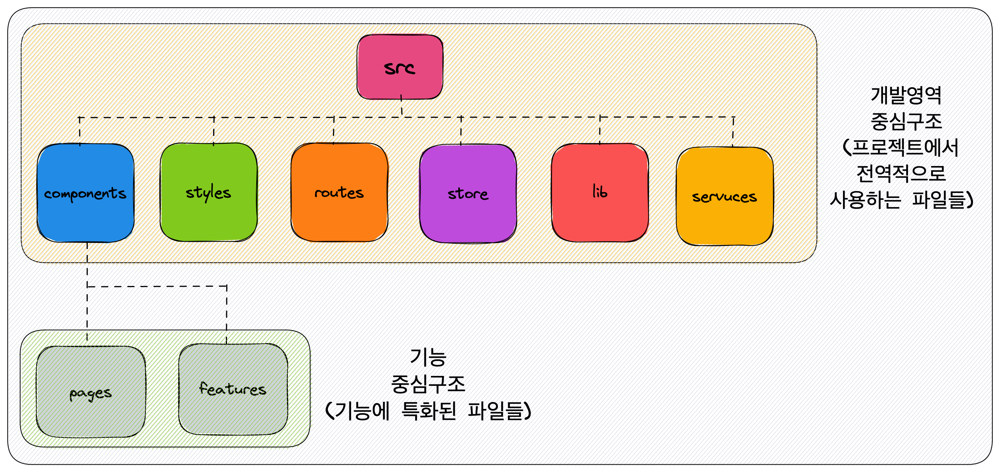

리액트 프로젝트는 기본적으로 정해진 폴더 구조가 없습니다. 그래서 리액트를 막 알게되고 간단한 프로젝트를 시작했을 때는 저만의 기준이 없어서 유명 레포나 다른 사람이 했던 리액트 프로젝트의 폴더구조를 그대로 가져와서 사용했었습니다.

그렇게 혼자서 프로젝트를 하는 시기에는 폴더 구조를 그대로 가져와 사용하는 게 큰 문제가 되지는 않았습니다. 폴더 구조에 상관없이 내가 어떤 파일들이 어디에 있는지 구현하면서 자연스럽게 알고 있어서 파일을 찾는 것이 힘들지 않았죠.

그런데 다른 프론트엔드 개발자와 협업하면서부터 문제가 생기기 시작했습니다. 각자 써오던 폴더구조들이 있다 보니 조율하는 게 쉽지 않았고 생소한 폴더 구조에 불편함을 드러내시는 분도 계셨습니다. 결국 합의가 되지 않아 폴더구조에 대한 기준이 없어지니까 새로운 파일을 추가하거나 수정을 위해 파일을 찾는 과정이 매우 힘들었습니다.

이런 과정을 겪고 나니 **작업하기 좋은 리액트 폴더구조는 어떤 형태가 되어야 하는가**? 에 대해 고민이 들기 시작했습니다.

### 내가 생각하는 폴더 구조 기본 원칙

제가 해온 프로젝트의 폴더구조를 다시 되짚어 보면서 느꼈던 것은 같은 로직을 공유하는 파일들이 불필요하게 다른 폴더에 **흩뿌려져 있었다는 점**이었습니다.

예를 들면 컴포넌트에 대한 스타일(style) 파일을 컴포넌트와 같은 폴더에 두는 것이 아니라 최상단의 style폴더안에 두는 폴더구조가 있었는데 코드가 추가될수록 관련된 코드를 최상위까지 올라가서 찾아봐야하는게 개발하면서 큰 스트레스로 다가왔습니다.

그런 파일들을 관련된것끼리 가깝게 위치시키니까 파일을 찾아보는 시간을 절약할 수 있어서 같이 작업하기가 편리했습니다. 그런 경험을 토대로 제가 생각하는 폴더구조의 기본원칙은 서로 **연관되어있는 파일들은 최대한 가깝게 위치시키는 것** 입니다.

실제 [리액트 공식문서](https://ko.legacy.reactjs.org/docs/faq-structure.html#dont-overthink-it)에도 관련파일을 가깝게 위치시키는 것을 강조하고 있으며 이것을 **colocation**이라고 부르고 있습니다.

> _그러면 서로 연관되어있다고 판단하는 기준은 어떤 것이 있을까요?_

저는 프로젝트를 경험하면서 `기능`과 `개발영역`이라는 2가지 기준으로 파일을 나누어왔습니다.

기능은 프로젝트에서 개발하는 특정한 기능을 뜻합니다. 예를 들면 로그인, 리스트 불러오기 같은 웹 페이지의 특정 기능이죠.

개발영역은 컴포넌트, 스타일링, 테스트 같은 프로젝트 전반적으로 작업해야하는 개발자가 생각하는 개발영역을 뜻합니다.

```
src
 ┣ Profile.css
 ┣ Profile.test.tsx
 ┣ Profile.tsx
 ┣ TodoList.css
 ┣ TodoList.test.tsx
 ┗ TodoList.tsx
```

중요한 점은 이 두 기준은 명확하게 상반되는 장단점을 가지기 때문에 프로젝트 전체에 한가지의 기준만 적용하는 것은 부적절하다는 점입니다. 위의 폴더구조를 두 기준에 따라 나누어보고 각각이 어떤 장단점을 가지는지를 설명드리겠습니다.

#### 1. 기능별로 나누기

```
src
 ┣ Profile
 ┃ ┣ Profile.css
 ┃ ┣ Profile.test.tsx
 ┃ ┗ Profile.tsx
 ┗ TodoList
 ┃ ┣ TodoList.css
 ┃ ┣ TodoList.test.tsx
 ┃ ┗ TodoList.tsx
```

- 장점: 기능별로 모여있다 👉 기능 관련 작업을 하기 편하다.
- 단점: 개발영역별로 모여있지 않다 👉 개발영역별로 작업하기가 힘들다

#### 2. 개발영역별로 나누기

```
 src
 ┣ components
 ┃ ┣ Profile.tsx
 ┃ ┗ TodoList.tsx
 ┣ styles
 ┃ ┣ Profile.css
 ┃ ┗ TodoList.css
 ┗ tests
 ┃ ┣ Profile.test.tsx
 ┃ ┗ TodoList.test.tsx
```

- 장점: 개발영역별로 모여있다 👉 개발영역별로 작업하기가 편하다
- 단점: 기능별로 모여있지 않다 👉 기능별로 작업하기가 힘들다

#### 🤔 어디까지 기준을 적용할 것인가?

사실 저는 알게 모르게 이때까지 진행한 프로젝트들은 위의 2가지 기준으로 폴더를 나누어왔습니다. 이미 수많은 리액트 프로젝트에서 이 두 기준으로 나누어왔기 때문에 자연스럽게 저도 똑같이 적용하고 있었던 거죠.

그렇지만 두 기준들의 장단점에 따라 프로젝트 영역 어디까지 적용할 것인가에 대한 고민은 없었기 때문에 폴더 구조를 올바르게 적용하고 있다는 생각이 들진 않았습니다. 그래서 리액트 프로젝트 전체 영역에 대해 생각해 보고 **개발자가 영역별로 어떤 부분에 집중하는가에 대해 고민**해봤습니다.

### 개발자의 관심사에 따른 폴더 구조

리액트 프로젝트 **최상단**에서 개발자의 관심사는 `개발영역`이라고 생각이 듭니다. 최상단에서는 이 프로젝트에서는 **전역적**으로 이루어져야하는 상태관리, 스타일링, 라우팅 등 필수 개발영역을 자주 생각합니다. 그래서
`src`폴더 아래에 위치하는 파일과 폴더는 개발영역 중심으로 카테고리화 합니다.



위의 그림을 기준으로 폴더 구조를 만들어 보았습니다.

이 구조는 [Create-React-App](https://create-react-app.dev/docs/getting-started) 혹은 [Vite](https://vitejs-kr.github.io/guide/)로 만든 CSR(Client-Side Rendering) React 프로젝트 기준으로 만들었습니다다

```
src
 ┣ components // 컴포넌트
 ┣ styles // 스타일링
 ┣ routes // 라우팅
 ┣ store // 상태관리
 ┣ lib // 유틸리티
 ┗ services // 데이터 페칭
```

#### Components부터 시작하는 기능 중심 관심사

React에서 프론트엔드의 핵심 기능인 User Interface는 컴포넌트로 만듭니다. 그래서 **컴포넌트 폴더**부터는 개발자의 주된 관심사는 컴포넌트가 가지는 `기능`이라고 생각합니다. 그래서 기능 중심의 폴더구조를 만드는 것이 효과적입니다.

components는 페이지 부터 작은 button까지 유형이 다양하지만, components의 최상위 집합체인 페이지 컴포넌트부터 아래의 서브 컴포넌트로 위에서 아래로 접근방식이 구조상 좀 더 어울립니다. 그래서 components 폴더 아래 각 페이지에 해당하는 컴포넌트들을 둘 수 있습니다.

```
src
 ┣ components
 ┃ ┣ Home
 ┃ ┣ Login
 ┃ ┗ MyPage
 ┣ styles
 ┣ routes
 ┣ store
 ┣ lib
 ┗ services
```

#### 페이지 컴포넌트 안에 위치하는 파일들

Home 폴더 아래에는 `Home.tsx` 파일만 있어도 되지만 컴포넌트에 필요한 부분들을 개발영역에 따라 분리하는 것이 특정 개발영역에 집중하고 관리하기 좋다고 생각합니다.

컴포넌트에 필요한 개발영역은 **view**, **스타일링**, **상태관리 로직**, **테스트** 등이 있을 수 있고 이 외에도 기능과 관련된 모든 것들이 이 폴더 아래 위치해야 합니다.



```
components
 ┣ Home
 ┃ ┣ Home.hooks.tsx
 ┃ ┣ Home.styles.css
 ┃ ┣ Home.test.tsx
 ┃ ┣ Home.tsx
 ┃ ┗ index.ts
 ┣ Login
 ┗ MyPage

```

#### 여러 페이지에서 재사용되는 기능 분리하기

페이지 기능개발을 하다 보면 여러 페이지에서 재사용이 가능한 기능들이 있을 수 있습니다. 예를 들면 button, Modal 같은 ui 기능부터 auth와 같은 큰 기능들은 따로 분리할 수 있습니다.

이런 경우에는 따로 components아래에 새로운 카테고리인 `features`라는 폴더를 만들고 기존의 페이지 컴포넌트들은 `pages`라는 폴더안으로 묶습니다.

```
components
 ┣ features
 ┃ ┣ auth
 ┃ ┗ ui
 ┃ ┃ ┣ Button
 ┃ ┃ ┗ Modal
 ┗ pages
 ┃ ┣ Home
 ┃ ┣ Login
 ┃ ┗ MyPage
```

큰 프로젝트의 경우에는 이 components 구조가 depth가 너무 깊다고 판단이 들 수 있는데 이 경우에는 components 폴더로 묶지 않고 features와 pages를 밖으로 빼낼 수도 있습니다.

```{2-3}
src
 ┣ features
 ┣ pages
 ┣ lib
 ┣ routes
 ┣ services
 ┣ store
 ┗ styles
```

#### 최종 구조



### 정답은 없다 그렇지만 확실한 기준은 있어야 한다

폴더 구조에는 정답은 없습니다. 팀에서 미리 정해진 규칙이 있다면 거기에 맞춰 작업하는 것이 제일 좋고 `Next.js`와 같은 프레임워크를 사용한다면 일부 정해진 폴더 구조를 사용해야 합니다.

폴더구조는 개발자의 편의성을 위해 파일을 카테고리화 하는 것일 뿐이므로 자신만의 기준에 맞춰 잘 작성하면 됩니다. 하지만 자신만의 기준을 **정말 자세하게 근거있게 세우는 것이 중요합니다**. 확실한 기준이 없다면 더 파일들이 추가될 수록 구조파악은 점점 힘들어집니다. 그리고 확실한 자신만의 기준이 있다면 새롭게 시작하는 팀 프로젝트에서도 팀원들을 설득시킬 수도 있으므로 한번쯤은 폴더구조를 어떻게 짜고 있었는지에 대해 다시 생각해보는 시간을 가지면 좋을 것 같습니다. 👏

### 참고한 자료

- https://ko.legacy.reactjs.org/docs/faq-structure.html
- https://profy.dev/article/react-folder-structure
