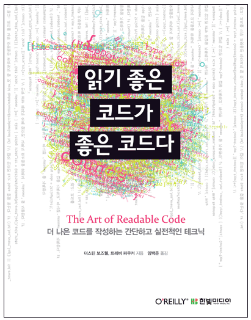

최근에 원티드에서 주최하는 프론트엔드 인턴십 프로그램을 수료하였습니다. 팀을 모아 기업과제를 수행하는 프로그램인데 특이했던 점은 협업방식이 팀원들이 기능을 나누어서 각자 개발하고 합치는 형식이 아니라 팀원 모두가 과제 전체를 만들고 결과물 중에서 **Best Practice**를 뽑아서 제출하는 방식이었습니다.

처음 해보는 방식이라 생소하기도 했는데 Best Practice를 뽑는 과정에서 서로의 코드에 대한 리뷰를 하면서 제 코드에 부족했던 점을 많이 알 수 있어서 좋았습니다. 다만 처음에 코드 리뷰를 할 때는 코드 전체의 아키텍쳐와 관련된 리뷰들을 기대했지만 막상 주고 받은 대부분의 리뷰가 _이 코드가 어떤 기능을 하는가요?_, _이 코드는 어디에서 쓰이는가요?_ 와 같은 low-level 단계에 관한 질문이었습니다.

나중에 팀 회고 시간때 코드 리뷰 과정이 어떤셨는지 질문을 드리니까 "다른 사람 코드 전체를 파악하는게 쉽지 않다"라는 의견이 대부분이셨습니다. 저도 사실 다른 분의 코드를 보면서 함수나 변수의 네이밍으로 부터 기능을 바로 파악하기 힘들었고 함수 안의 로직들도 관심사 별로 잘 분리가 안되어 있어서 피로감이 컸습니다. 아마 다들 코드를 파악하는 곳에서 부터 막히셔서 코드 전체의 아키텍쳐 부분에 대한 질문을 주고 받지 못했던 것 같았습니다.

프로그램을 마치고 회고를 해보니 코드를 다른 사람들이 보았을 때도 빠르게 파악할 수 있도록 가독성 좋게 짜고 싶다는 생각이 들었습니다. 그래서 관련 책이 있나 열심히 찾아보다가 이 책을 발견했습니다. 책 이름 '읽기 좋은 코드가 좋은 코드다'가 프로젝트을 마친 후 제 생각을 대변해주는 것 같기도해서 뭔가 홀린 듯 구매해서 읽었습니다.

### 읽기 좋은 코드가 좋은 코드다


_\* 이미지 출처 : The Art of Readable code(읽기 좋은 코드가 좋은 코드다)_

책을 다 읽고 돌이켜보니까 이 책의 전체를 관통하는 주제는 `코드는 이해하기 쉬워야 한다`라고 말할 수 있을 것 같습니다. 전체적인 내용이 코드를 이해하기 쉽게 바꾸는 방법론에 관한 내용입니다.

책은 크게 3가지 주제로 개선방법을 설명하고 있습니다

> 1. 이름을 이해하기 쉽도록 개선하기
>
> 2. 루프와 논리 단순화하기
>
> 3. 코드 처음부터 다시 작성해보기

### 1. 이해하기 쉬운 이름을 사용하기

**코드 개선 중에서 가장 쉽게 바꿀 수 있고 효과도 좋은 것이 이름을 바꾸는 것**입니다. 저는 개인적으로 읽으면서 이 주제가 제일 유익했습니다. 제가 항상 코드를 작성할 때 이름을 짓는 걸 힘들어 하고 좋은 이름일까 고민도 많이 해서 도움이 많이 되었습니다.

이해하기 쉬운 이름이란 어떤 이름일까요? 책에서는 이해하기 쉬운 이름을 작성하는 원칙을 다음과 같이 말하고 있습니다.

> 이름은 구체적이여야 하며 정보를 담고 있어야 한다

이해하기 쉬운 이름이란 결국 코드를 읽는 사람에게 더 많은 정보를 제공하는 이름입니다. 그러기 위해서는 **충분히 구체적인 단어를 사용하고 많은 정보를 담고 있어야 합니다**

```ts{7-9}
// 이 함수 이름 보다는
const getData = () => {
  fetch(someServerEndpoint);
};

// 이 함수 이름이 동작을 알아보기 쉽다
const fetchData = () => {
  fetch(someServerEndpoint);
};
```

위와 같이 getData 보다는 fetchData가 좀 더 함수의 기능을 예측하기 쉽습니다.그래서 get같이 보편적이고 흔한 단어보다는 함수의 동작을 자세히 묘사해주는 단어를 선택하는 것이 좋습니다.

좀 더 나아가자면 어떤 data인지 까지 명시해주는 게 좋습니다

```ts{6-9}
const fetchData = () => {
  fetch(someServerEndpoint);
};

// 어떤 data인지 추가
const fetchServerData = () => {
  fetch(someServerEndpoint);
};
```

> 정보를 넣다가 이름이 너무 길어지면 어떻하나요?

구체적으로 작성하면 할수록 이름이 길어질 수 있습니다. 너무 길면 가독성에 좋지 않습니다. 몇자까지가 적당한지는 책에는 안 나와 있지만 저 같은 경우는 긴 영어단어 3개 혹은 짧은 영어단어 4개가 이어진 형태가 마지노선이라고 생각합니다.

3~4개 단어면 충분히 동작을 표현하는데 무리가 없고 읽기 부담스럽지 않습니다. 혹시 3단어 이상 더 필요하다고 생각이 드시면 **변수나 함수가 하는 역할이 너무 많은지 생각**해봐야 합니다. 하는 역할이 많으면 이름에 넣어야 할 정보도 많아지므로 그럴 경우에는 기능을 쪼개시는 걸 추천드립니다.

### 2. 루프와 논리 단순화 하기

저는 조건문이나 함수의 내용도 하나의 이야기라고 생각합니다. 코드를 읽는 사람은 위에서 아래로 차근차근 읽어가는데 이야기가 뒤죽박죽이면 읽기가 싫어질겁니다.

책에서는 다양한 기법을 소개하고 있지만 핵심적인 내용은 3가지라고 생각합니다.

> 1. 간단하거나 중요한 것을 먼저 처리하자
>
> 2. Early return을 사용해서 단순한 흐름을 만들자
>
> 3. 설명변수나 요약변수를 추가해보자

#### 간단하거나 중요한 것을 먼저 처리하자

첫인상이 중요하듯 가장 중요하게 처리해야 하는 것을 상단에 놓으면 코드를 파악하기 쉽습니다. 예를 들면 다음과 같이 'expand_all'이라는 query parameter에 따라 다른 형태로 보여주는 if/else코드가 있습니다.

```ts
if (!url.hasQueryParameter('expand_all')) {
  render(items);
} else {
  render(items.map((item) => expandItemSize(item)));
}
```

이 코드에서 가장 중요하게 처리해야 할 것은 'expand_all'이라는 파라미터가 있을 때 어떻게 처리해야 하는 가일겁니다. 하지만 위는 반대로 되어있습니다.

```ts
if (url.hasQueryParameter('expand_all')) {
  render(items.map((item) => expandItemSize(item)));
} else {
  render(items);
}
```

다시 작성하면 다음과 같습니다. 위와 같이 좀 더 중요한 것, 부정이 아닌 긍정부터 다루는게 흐름을 파악하기 쉽습니다.

#### Early return을 사용하자

간혹 원하지 않지만 중첩문을 작성해야 할 때가 있습니다. 동작시키기 위해서 어쩔수없이 작성하지만 중첩문은 작성하는 사람도 보는 사람도 머리를 아프게 만듭니다.

이럴 땐 **early return**을 사용해서 흐름을 단순하게 만들 수 있습니다

```ts
if (user_result === 'SUCCESS') {
  if (permission_result !== 'SUCCESS') {
    reply.writeErrors('permission error');
    reply.done();
    return;
  }
  reply.writeErrors('');
} else {
  reply.writeErrors(user_result);
}
reply.done();
```

위 중첩문을 어떻게 제거할 수 있을까요?

먼저 이 로직이 핵심 내용은 **에러를 작성하는 것**입니다. 그래서 user_result가 SUCCESS가 아닐때를 먼저 처리하는 것이 함수내용과 맞습니다.그리고 중첩문을 봐서 user_result에 대한 내용을 먼저 처리하는게 큰 조건이므로 해당 조건을 먼저 처리하여 early return합니다. permission_result는 부가 조건이므로 뒤에 처리해도 좋습니다.

```ts
if (user_result !== 'SUCCESS') {
  reply.writeErrors(user_result);
  reply.done();
  return;
}

if (permission_result !== 'SUCCESS') {
  reply.writeErrors(permission_result);
  reply.done();
  return;
}

reply.writeErrors('');
reply.done();
```

이렇게 작성하면 위에서 아래로 차례대로 읽어도 어떤 로직인지 바로 파악할 수 있습니다.

#### 설명변수 & 요약변수를 추가하자

특정 표현식이 복잡해지면 표현식을 설명해주는 또는 요약해주는 변수를 넣으면 코드를 파악하기 쉬워집니다

```ts
// 예시 1
if (line.split(':')[0] === 'root') {
    ...
}

const username = line.split(':')
if (username === 'root')
```

```ts
// 예시 2
if (request.user.id === document.owner_id) {
    ...
}

const userOwnsDocument = request.user.id === document.owner_id
if (userOwnsDocument) {
    ...
}
```

이렇게 작성하면 길어지는 표현식이 어떤 의미인지 변수를 통해서 알수있습니다.

### 3. 코드 처음부터 재작성 하기

저도 그렇지만 코드가 너무 엉망이면 처음부터 다시 작성하고 싶을 때가 있습니다. 완전 재시작하고 싶은 경우이죠. 저는 재시작이 의외로 도움이 될 때가 많이 있었습니다. 필요한 로직들을 다시 점검해보는 시간들을 통해 버그도 많이 발견했습니다.

책에서는 필요한 로직들을 명확하게 말로 설명을 적어보면 훨씬 도움이 될 것이라고 설명해주고 있습니다. 옆 동료에게 말하듯이 묘사를 하고 그 말에서 핵심이 되는 단어와 문구를 포착하고 코드를 작성하는 흐름입니다. 그런데 중요한 점은 영어로 묘사해야 한다는 것입니다. 😱 아무래도 프로그래밍 언어가 영어로 되어있기 때문이겠죠? 😭

이 주제의 핵심 흐름은 다음과 같습니다

> **STEP 1**. 코드를 말로 표현하자  
> **STEP 2**. 코드에서 불필요한 코드를 없애고 중복되는 코드를 찾아서 분리하자

말로 표현하면 로직에서 불필요했던 코드들 그리고 중복적으로 사용되는 유틸리티 코드들이 있었다는 사실을 알게 됩니다. 삭제할껀 삭제하고 재사용하는 것들을 분리한다면 남아있는 코드는 **특정 로직의 핵심을 다루는 내용**이 됩니다. 그렇다면 코드는 더욱 명확해집니다.

### 개인적인 생각 및 후기

이 책을 읽으면서 코드 작성에 대해 다시 생각해보게 되었습니다. 읽는 동안 명확하고 가독성 좋은 코드를 작성하는 것이 설명문을 작성하는 것과 유사하다는 생각이 많이 들었습니다. 아무래도 둘의 공통점이 읽히기 위해 존재하기 때문이라고 생각합니다

읽고 난 후에는 개인적으로는 혼자 코드를 작성할 떄도 이해하기 쉬운 코드를 짜야할까?와 이해하기 쉬운 코드의 의미를 좀 더 깊게 생각해보게 되었습니다.

#### 혼자 할 때도 이해하기 쉬운 코드를 짜야 하나?

사실 책을 읽고난 후에 _혼자서 하는 프로젝트에서는 위 작업들을 해야 할까?_ 라는 생각이 들었습니다. 코드를 작성하면서 코드에 대한 흐름이 머릿 속에 들어있어 이미 읽기 쉬운 코드가 되었기 떄문에 꼭 필요할까라는 생각이 들죠.

그런데 다시 생각해보니 오래전에 했던 프로젝트를 리팩토링 했던 떄에 제 코드의 로직과 흐름들을 일부 까먹어서 다시 파악하는데 애를 좀 먹었던 기억을 생각하니 상황에 따라서 **내가 다른 사람이 처음 코드를 보았을 때랑 같은 위치에 놓일 수도 있겠구나**라는 깨달음을 얻었습니다.

그렇기 때문에 코드를 작성할 떄는 '**다른 사람이 보았을 때도 이해하기 쉬운 코드**'를 짜는 것을 목표로 두고 작성하는게 좋지 않을까? 생각합니다.


_\* 이미지 출처 : The Art of Readable code(읽기 좋은 코드가 좋은 코드다)_

#### 이해하기 좋은 코드에 대한 의미 확장

책을 읽다보니까 이해하기 좋은 코드를 만드는 건 책에서 소개하는 기법만 있는 것이 아니라는 생각이 들었습니다.

이해라는 것은 결국 정보에서 오는 것인데 코드에서 사용되는 디자인 패턴, 라이브러리, API들에 대한 정보들도 코드를 이해하는데 중요한 역할을 합니다.

그런 측면에서 **협업하는 팀원들끼리 같은 주제에 대해 스터디**를 하고 다 같이 아는 정보가 많다면 서로의 코드를 파악하는 게 훨씬 쉬울 것 같다는 생각이 들었습니다.
